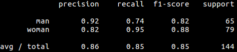

# Kman_woman
This  a temporary directory. The purpose is to classify men and women dataset on cpu.

## Commands
``` shell
$ python finetune.py --dataset data/ --model output/man_woman.model
```
- **--dataset**: Path to dataset on which you want to learn.
- **--model**: Path to save new NN model.

## Results
Observe in the figure below that how val_acc and acc roughly remain high and same . This is a sign that model will generalize well on unseen data. The final validation accuracy is 85.42


Below is sklearn classification report
- **precision**: The intuitively the ability of the classifier not to label as positive a sample that is negative.
- **recall**:  The intuitively the ability of the classifier to find all the positive samples.
- **support**:The support is the number of occurrences of each class in y_true.


Below is evolution of loss/acc. Observe that they remain same for validation and train set roughly througout the training .


## Environment
Pyhton3.5.2, OpenCV3.3.0, sk-learn0.19, matplotlib2.1, Keras2.1 and all the standard libs were used.

